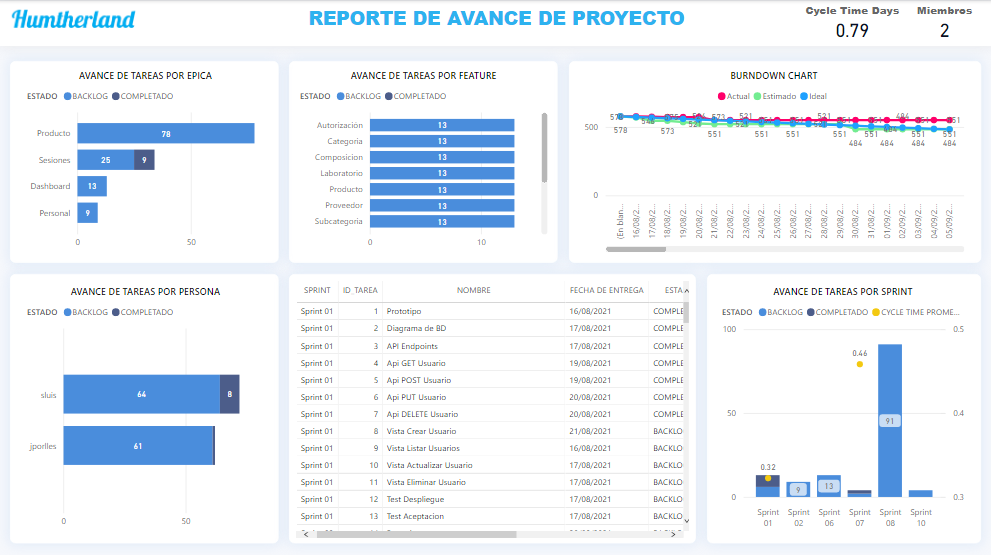

# Proyecto: Reportes de avance de proyecto ágil

## Contenido
1. [Información General](#general-info)
2. [Tecnologias](#tecnologias)
3. [Instalacion](#instalacion)
4. [Accesos](#accesos)
5. [Uso](#uso)

## General Info
***
Reporte en Power BI para ver el avance de proyecto ágil y detalle de tareas. 
### Screenshot


## Tecnologias
***
Lista de tecnologías utilizadas en el proyecto:
* [Power BI](https://example.com): Version 2.102.683.0 64-bit (febrero de 2022) 
* [Microsoft Excel 2021](https://example.com): Version 2108 (16.0.14332.20204) 64 bits

## Instalacion
***
Clonar el repositorio con los siguientes comandos. (No requiere instalación) 
```
$ git clone https://github.com/samuel14luis/project-reports.git
$ cd ../path/to/the/file
```
Nota: Para un funcionamiento adecuado utilizar ```Excel 2012 en adelante``` y ```Power Bi 2.1 en adelante```

## Accesos
***
Contraseña del VBA Project: humtherland2021


Contraseñas: 

  ACCESO_TEAM: acceso@nivel01 - ```Mostrar tabla Tareas y Registro de tareas```
  
  ACCESO_MANAGER: acceso@nivel05 - ```Mostrar todas las tablas```
  


## Uso
***
MODO MANAGER: Planificar y dar mantenimiento a las tablas en Excel.

### Diagrama de relaciones


TABLAS A LAS QUE ACCEDE
* [TB_PROYECTOS]
* [TB_EPICAS]
* [TB_FEATURES]
* [TB_USERSTORIES]
* [TB_SPRINT]
* [TB_AREAS]
* [TB_PERSONAS]
* [TB_EQUIPO]
* [TB_TAREAS]


MODO TEAM: Cada miembro del equipo debe revisar sus tareas y actualizar el estado en el Registro de tareas.
### Estados de tarea


TABLAS A LAS QUE ACCEDE
* [TB_TAREAS] SOLO VER
* [TB_REGISTROS] ACTUALIZAR
